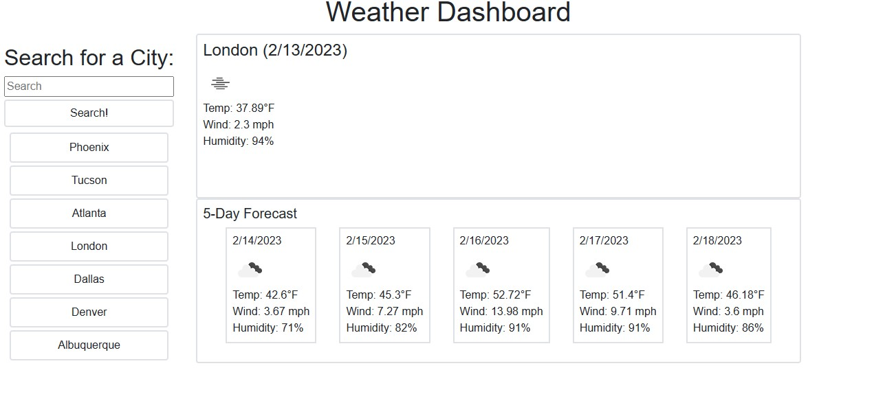

# Weather-Dashboard

## Description

This website was created as a tool to help users see the current weather and a forecast of the next 5 days. The purpose would be to assist anyone with planning on what to wear or determine what they'd like to do on a certain day depending on the weather.

Screenshots as follows:

[Work Day Scheduler Webpage](https://jmcdlungren.github.io/Weather-Dashboard/)

[GitHub Repository Link](https://github.com/jmcdlungren/Weather-Dashboard)

## Usage

The user can enter in the city where they're wanting to know the weather. The site than populates the current weather and a 5 day forecast. It also saves the user's input in a button below that they can click later to see the weather of that city again. If the city is already listed below, then a new button with the same city name is not created.

## Credits

N/A

## License

Please refer to the LICENSE in the repo.